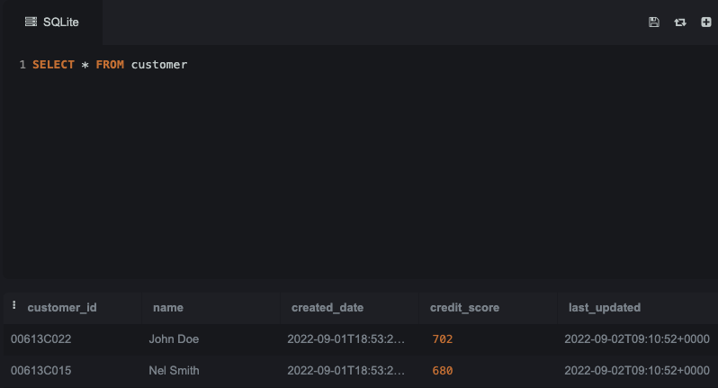
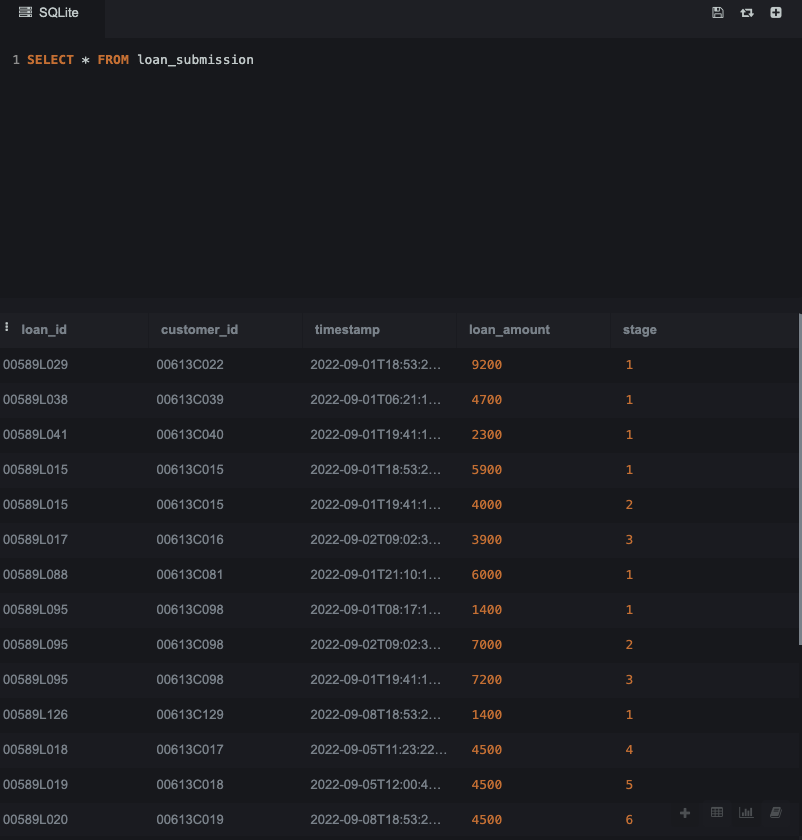
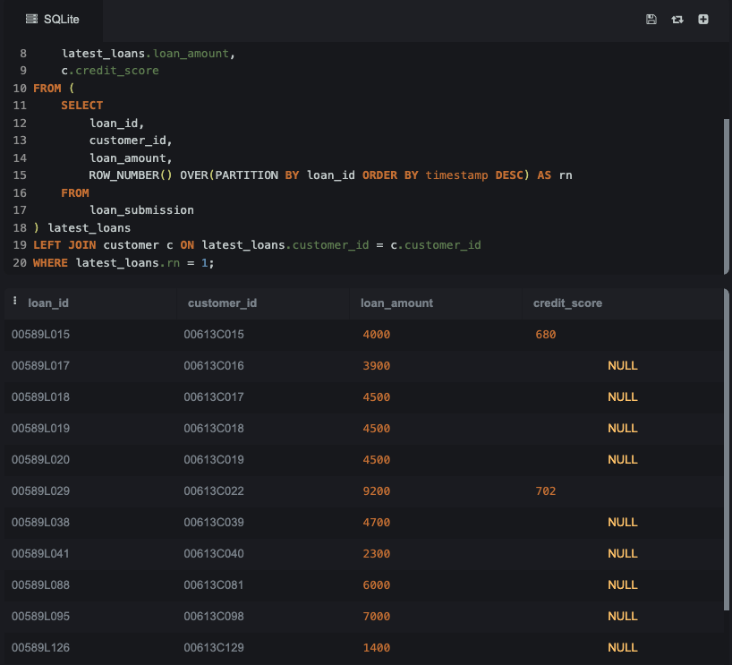
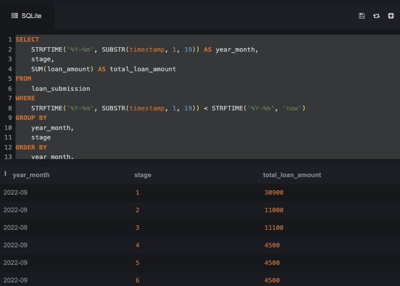

# GoodLeap Assessment for Senior Data Engineer

Before I started the analysis query, I created 2 tables [loan_submission.sql](loan_submission.sql) and [customer.sql](customer.sql).

### customer table

### loan_submission


## 1. Write a SQL query that gets the latest loan amount and customer credit score for all loans.


```sql
--- SQL Query
SELECT
    latest_loans.loan_id,
    latest_loans.customer_id,
    latest_loans.loan_amount,
    c.credit_score
FROM (
    SELECT
        loan_id,
        customer_id,
        loan_amount,
        ROW_NUMBER() OVER(PARTITION BY loan_id ORDER BY timestamp DESC) as rn
    FROM
        loan_submission
) latest_loans
LEFT JOIN customer c ON latest_loans.customer_id = c.customer_id
WHERE latest_loans.rn = 1;

--- Note: 
--- 1. use window function to find the latest loan from latest timestamp
--- 2. left join customer table to get credit score
```
### SQL file: [analysis_latest_loan_amount.sql](analysis_latest_loan_amount.sql)

### Expected Output:


## 2. Write a query that returns the loan amount per stage on a monthly basis year to date. Do not show data for incomplete months.

```sql
SELECT
    STRFTIME('%Y-%m', SUBSTR(timestamp, 1, 19)) AS year_month,
    stage,
    SUM(loan_amount) AS total_loan_amount
FROM
    loan_submission
WHERE
    STRFTIME('%Y-%m', SUBSTR(timestamp, 1, 19)) < STRFTIME('%Y-%m', 'now')
GROUP BY
    year_month,
    stage
ORDER BY
    year_month,
    stage;
--- Note
--- 1. turn timestamp to year month
--- 2. group by year_month and stage
--- 3. do not show data for incomplete months: use where to filter data in current month.
```
### SQL file: [analysis_per_stage.sql](analysis_per_stage.sql)

### Expected Output:


## 3. To support analysis work, write a table that normalizes the loan funnel data so that for a given loanid, we know the date the loan reached that stage and the loan amount for that stage. You may use SQL, Scala, or Python.

### step 1. create a table
```sql
--- normalize table for loan
CREATE TABLE loan_stage_details (
    loan_id TEXT,
    stage INTEGER,
    stage_date TIMESTAMP,
    stage_loan_amount INTEGER
);
```

### step 2. transform data from loan_submission table
```python
# Normalize Data in Pyspark
from pyspark.sql.functions import col
from pyspark.sql import SparkSession

# Initialize a Spark session
spark = SparkSession.builder \
    .appName("Loan Funnel Normalization") \
    .getOrCreate()

# Load the loan submission data into a DataFrame
loan_submission_df = spark.read.format("csv") \
    .option("header", "true") \
    .load("path_to_your_loan_submission_data.csv")

# Normalize the data
normalized_loan_df = loan_submission_df.select(
    col("loan_id"),
    col("stage"),
    col("timestamp").alias("stage_date"),
    col("loan_amount").alias("stage_loan_amount")
)

# Write the normalized DataFrame to a new file
normalized_loan_df.write.format("csv").mode("overwrite").save("path_to_your_normalized_loan_data.csv")
```

## 4. Right now customer is an exact copy of the source table that’s loaded into our data warehouse after Truncating the existing customer table as a single command. Explain how we could change that to support analyses of loan submissions as of point in time while making the process more robust.

To improve this, I would suggest the following steps

1. Use Transactions to Ensure Data Integrity: this will make sure the table exists
2. Copy the data from application database(ex: AWS RDS postgres/MySQL) to S3 (ex: Sqoop in EMR)
3. Create a staging table, and copy the data from s3 into the staging table
4. Airflow can dynamically generate the staging table with the current date
5. Add on call alert(like page duty) and send failed DAG alert to slack
For example:
``` sql
BEGIN TRANSACTION;
-- step 1: drop staging table (in case this is a retry)
DROP TABLE IF EXISTS customer_staging_20240313;

-- step 2: create staging table
CREATE TABLE customer_staging_20240313 (
    customer_id TEXT PRIMARY KEY,
    name TEXT,
    created_date TIMESTAMP,
    credit_score INTEGER,
    last_updated TIMESTAMP
);

-- step 3: copy data from S3 into staging table
COPY customer_staging_20240313 ("customer_id", "name", "created_date", "credit_score", "last_updated")
FROM 's3://path/avro/customer/date=2024-03-13/'
IAM_ROLE 'arn:aws:iam::aws_id:role/RedshiftRole'
FORMAT AVRO 's3://path/customer.json'
TRUNCATECOLUMNS ACCEPTINVCHARS ACCEPTANYDATE;

-- erasure statements on staging table
-- step 4: clear target statement
TRUNCATE TABLE customer;
INSERT INTO customer (
        customer_id
        , name
        , created_date
        , credit_score
        , last_updated
)
SELECT
        customer_id
        , name
        , created_date
        , credit_score
        , last_updated
FROM customer_staging_20240313 
;

-- step 5: drop staging table (to clean up)
COMMIT TRANSACTION;
```

## 5. How would you ensure data quality in this new pipeline?
What I can think of, we can have monitor jobs to check the tables

*Data Level*
1. set up some business rule for the table
2. check the statistics for core column, if the daily add up number is in certain std
3. check the volume of data 
4. check data schema, if there is any data schema change, send alerts
5. set up a central schema repo to collect all data schemas

*Jobs(DAG) or Deployment (Airflow)*

6. CI/CD can check basic data type, and volumn of data
7. Send alerts if any upstream and downstream job failed
8. Check all dags successfully run daily

### DBT data quality check
We can also try dbt to set up some YAML file to check data quality
1. During Deploy
2. Production
3. In Dev

```yaml
models:
  - name: dim_hosts_cleansed
    description: Cleansed table for the Customer
    columns:
      - name: customer_id
        description: The id of the customer. This is the primary key.
        tests:
          - not_null
          - unique      
      - name: name
        description: The name of the customer
        tests:
          - not_null
      - name: credit_score
        description: Defines credit_score.
        dbt_expectations.expect_column_quantile_values_to_be_between:
              min_value: 0
              max_value: 850
```